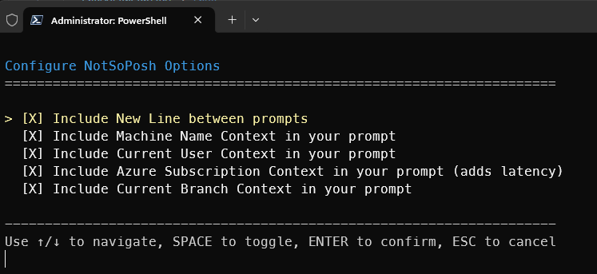
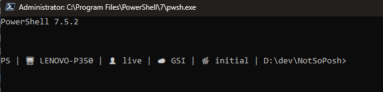

# NotSoPosh

A configurable PowerShell prompt enhancer that adds contextual information to your command line interface.

## Features

NotSoPosh provides an interactive setup menu to customize your PowerShell prompt with the following optional components:

- **New Line Separator**: Add a blank line between prompts - makes history easier to parse
- **Machine Name Context**: Display the computer name
- **User Context**: Show the current username
- **Azure Subscription Context**: Display the active Azure subscription name (requires Azure CLI)
- **Git Branch Context**: Show the current Git branch (requires Git)

## Interface



*Interactive setup menu with selectable options*

## Prompt Example



*Customized prompt showing available options*

## Requirements

- PowerShell 7+
- Azure CLI (optional, for Azure subscription context)
- Git (optional, for Git branch context)

## Installation

1. Clone or download this repository
2. Navigate to the NotSoPosh directory
3. Run the setup script:
   ```powershell
   .\NotSoPoshSetup.ps1
   ```

## Usage

### Configuration
Run `NotSoPoshSetup.ps1` to configure your prompt preferences using the interactive menu:
- Use arrow keys to navigate options
- Press spacebar to toggle selections
- Press Enter to confirm and apply settings
- Press Escape to cancel

### Reconfiguration
Re-run `NotSoPoshSetup.ps1` at any time to modify your prompt settings. The script remembers your previous selections and updates only the changed options.

### Removal
To remove the NotSoPosh prompt override, manually edit your PowerShell profile and remove any NotSoPosh references:
```powershell
notepad $PROFILE
```

## Implementation Notes

- **Configuration**: Settings are stored in a git ignored local `notsoposh.config.json` for persistence between configuration sessions.
- **Deployment**: Scripts are copied to a `~/.notsoposh/` directory to avoid repo dependencies in PROFILE
- **Profile Integration**: PowerShell PROFILE is appended with a script reference the NotSoPosh prompt override.
- **Performance**: Context lookups are cached where possible to minimize latency.
- **Compatibility**: Designed for Windows PowerShell 7+

## Notes
- Azure subscription context lookups add minimal latency due to CLI calls

## TODO
- Allow ordering of prompt extensions
- Add more prompt extensions
    - Time/Time zone
    - Current directory
    - Custom user-defined variables
    - Add support for additional cloud providers (AWS, GCP)
    - Add more Git context options
